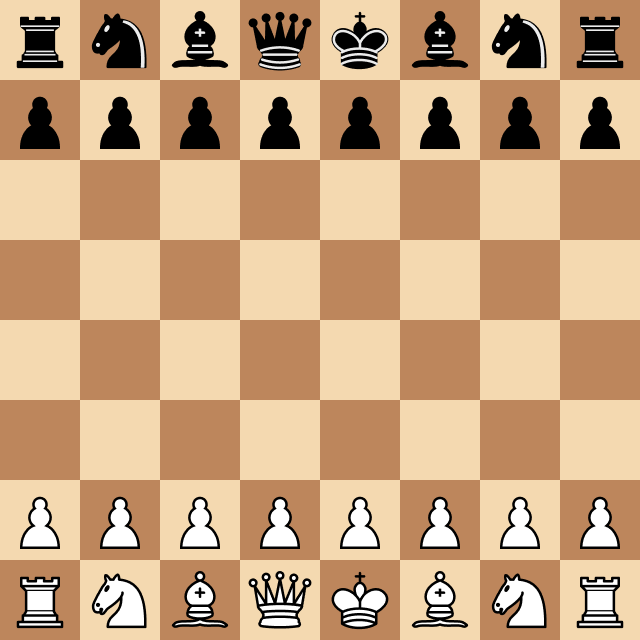
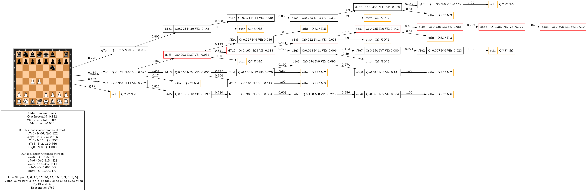

# Dinora

[Installation & Usage](/docs/installation_usage.md)
| [Training](/docs/training.md)

An alphazero-like chess engine. It uses 
pytorch ConvNet for position evaluation and Monte Carlo Tree Search for 
calculating best move.

### Features
- Alpazero-like chess engine
- Convolutional Neural network in pytorch
- Monte Carlo Tree search + Tree visualization tool
- Supervised learning from pgns with Stockfish evals annotation
- Supervised learning solely from game outcome (Without stockfish evals)
- Current dataset made from [lichess elite database](https://database.nikonoel.fr/)
- UCI interface: Play using GUI programs or online on [lichess](https://lichess.org/@/Dinora)
- Multi-backend architecture to swap search strategies (Simple MCTS, Extended
MCTS) and position evaluators (pytorch, onnx)

#### Work in progress
- MCTS with Virtual Loss to improve parallelization
- Reinforcement learning 
- More NN models (Smaller Convnet, Transformers)

## Status
Dinora supports standard chess variations and time controls, with or without increment. Initial testing suggests an approximate Elo rating of 2507 (±60 at 1+0 TC) against Stockfish capped with the UCI_Elo flag.

For testing, use the Elo evaluation tool found at `src/elofish`
```python -m elofish --help```

Dinora was also available as a [lichess bot](https://lichess.org/@/Dinora), but it is currently offline. However, its game history is still accessible.

### Example game

Dinora vs Stockfish 16.1 **capped with flag UCI_Elo 2412**
Time Control: 1+0



## Tree Visualization

Dinora provides a tool for visualizing the MCTS search tree



Original vector images can be found at (/assets/treeviz-example/)  
To generate new visualizations see
```python -m dinora treeviz --help```

# Acknowledgements

- [AlphaZero](https://deepmind.google/discover/blog/alphazero-shedding-new-light-on-chess-shogi-and-go/) The foundation for AlphaZero-inspired engines
- [Zeta36/chess-alpha-zero](https://github.com/Zeta36/chess-alpha-zero)
First/(one of the first) open source alphazero implementation in python
- [dkappe/a0lite](https://github.com/dkappe/a0lite) NN + MCTS in 95 lines of
python code
- [Chess Wiki](https://www.chessprogramming.org) Good resource on chess engines
  in general
- [int8 MCTS article](https://int8.io/monte-carlo-tree-search-beginners-guide/)
  Intro to MCTS blog post
- [Deep Dive MCTS](https://www.moderndescartes.com/essays/deep_dive_mcts/)
Another great article on MCTS
- [Stockfish](https://stockfishchess.org/) Strongest chess engine, used here for
  test / training data annotation
- [Leela Chess Zero](https://lczero.org/) If you really want to use AlphaZero
inspired chess engine this is the real one
- [Pytorch](https://pytorch.org/) Library to train neural networks
- [Python chess](https://python-chess.readthedocs.io/en/latest/) Library for
chess (rules, legal moves generator, pgn reader/writer, UCI interface)
- [Lichess Elite Database](https://database.nikonoel.fr/)

